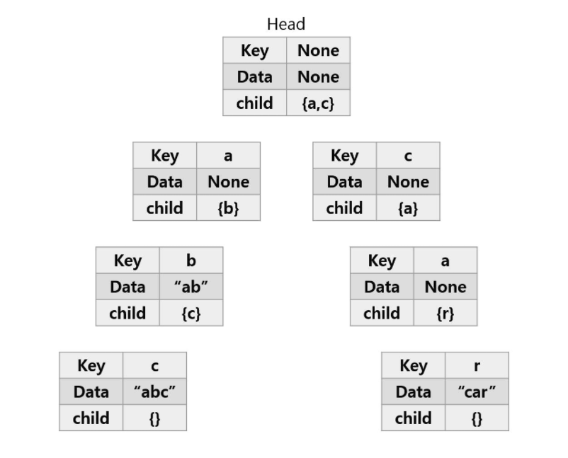

### Trie(트라이)란?
문자열을 저장하고 효율적으로 탐색하기 위한 트리 형태의 자료구조이다.  
= radix tree = prefix tree = retrieval tree

### Trie 장단점
- 문자열 검색을 빠르게 한다.  
- 문자열을 탐색할 때, 하나씩 전부 비교하면서 탐색을 하는 것보다 시간 복잡도 측면에서 훨씬 더 효율적이다.  
- 각 노드에서 자식들에 대한 포인터들을 배열로 모두 저장하고 있다는 점에서 저장 공간의 크기가 크다는 단점이 있다.

### Trie 구조
[key, data, child]  
  
abc, ab, car 삽입